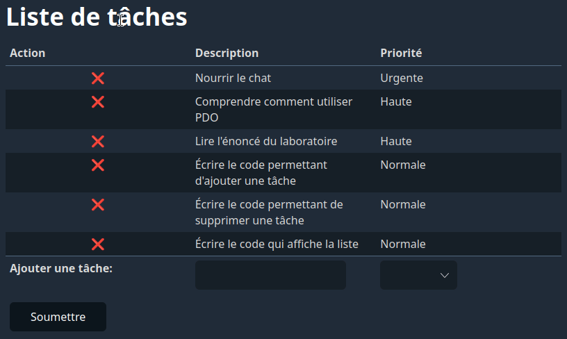

# Laboratoire 06-A

En utilisant la base de données "Tâches" dont le script de création se trouve dans le dossier `SQL`, reproduisez la page Web suivante en PHP en utilisant PDO:

Utilisez l'[exemple vu en classe](https://github.com/420-715-FE/exemples-bd/tree/main/exemple1) comme référence pour l'utilisation de PDO. **N'essayez cependant pas de partir d'une copie du code de cet exemple**, car ce que vous avez à faire est beaucoup plus simple! Tout peut se faire dans le fichier `index.php`.
